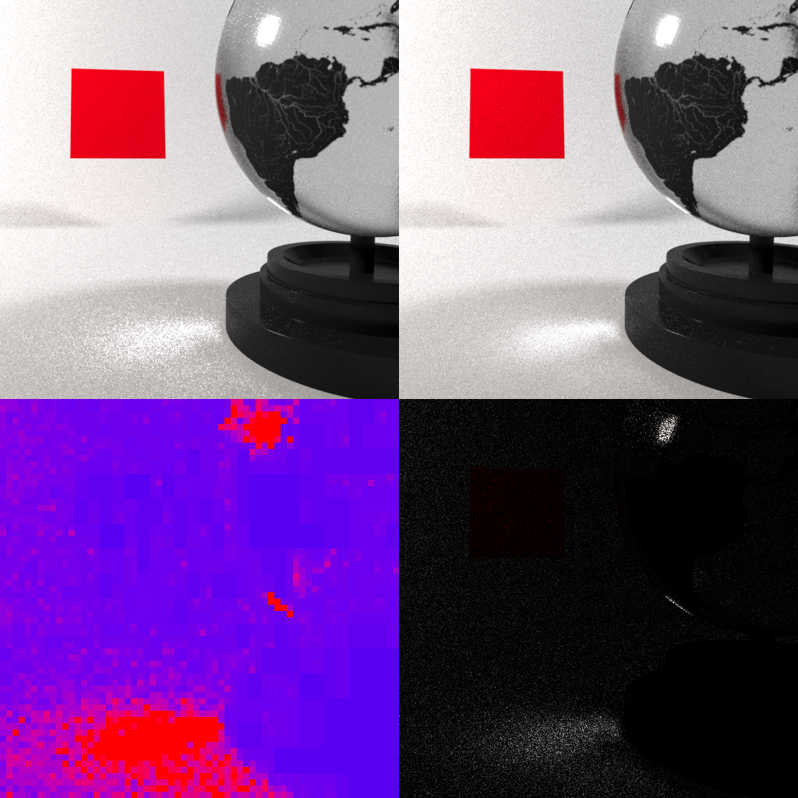
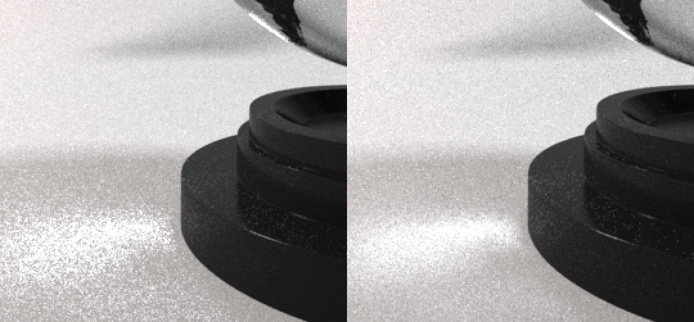
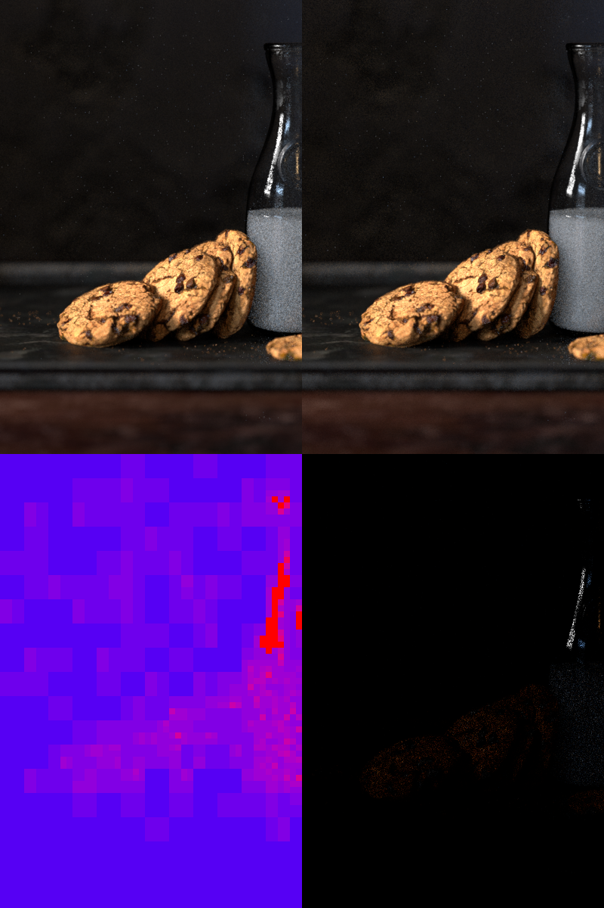
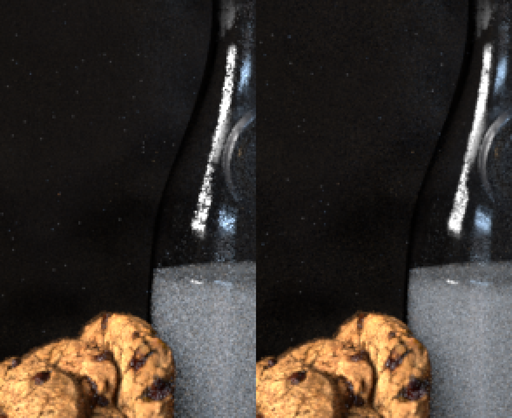

# Final Report - Google Summer of Code 2018

## Adaptive Image Plane Sampling and Resumable Rendering for appleseed

I was lucky to participate at GSoC 2018. I enjoyed my summer to work on 2 different projects. I succesfully finished the first project (adaptive sampling) and the second one is waiting to be merged.
You can take a look at the [original proposal](appleseed-proposal.md). All the code that I wrote was merged into master and will be available for the next release, except resumable rendering's whose review is pending. 

### Community bonnding period and before

Before GSoC started, I made some pull requests that were merged into master to get familiar with the code base.

- [Let frame/tile/pixel engines print their parameters when rendering starts](https://github.com/appleseedhq/appleseed/pull/1859)
- [Don't reset trackers when sampling is finished](https://github.com/appleseedhq/appleseed/pull/1862)
- [Save extra AOVs](https://github.com/appleseedhq/appleseed/pull/1865)
- [Wire up correctly OSL's printf() to the renderer's logger](https://github.com/appleseedhq/appleseed/pull/1881)
- [Create a diagnostic AOV for invalid samples](https://github.com/appleseedhq/appleseed/pull/1888)
- [Allow sending AOV tiles to stdout](https://github.com/appleseedhq/appleseed/pull/1906)
- [Export main aovs instead of extra aovs](https://github.com/appleseedhq/appleseed/pull/1954)
- [Implement Correlated Multi-Jittered Sampling](https://github.com/appleseedhq/appleseed/pull/1975)
- And other smaller features ...

We started talking about adaptive sampling even before GSoC started. During the community bonding period, we talked about different possibilites and what algorithm should be implemented. I also enjoyed this period to read some papers and other renderer's documentation to get an idea of what is the current state-of-the-art of adaptive image sampling.

### Code

These are the pull requests I submited during the coding period. Sorted from the oldest to the newest one.

- **[Adaptive Sampling](https://github.com/appleseedhq/appleseed/pull/2062)**
- [Add a precision parameter for statistics](https://github.com/appleseedhq/appleseed/pull/2067)
- [Mark unsampled pixels as red in the invalid samples AOV](https://github.com/appleseedhq/appleseed/pull/2069)
- [Implement weighted population](https://github.com/appleseedhq/appleseed/pull/2078)
- [Refactor AABB class](https://github.com/appleseedhq/appleseed/pull/2095)
- [Expose pause and resume in studio](https://github.com/appleseedhq/appleseed/pull/2096)
- [Allow to write/read extra attributes from exr files](https://github.com/appleseedhq/appleseed/pull/2099)
- [Make percent statistics mergeable](https://github.com/appleseedhq/appleseed/pull/2107)
- [Fix missing extension when saving a file from studio](https://github.com/appleseedhq/appleseed/pull/2108)
- [Refactor CameraController](https://github.com/appleseedhq/appleseed/pull/2112)
- **[Resumable rendering: save and restore checkpoints](https://github.com/appleseedhq/appleseed/pull/2120)**
- [Use regular AOVs to export diagnostic AOVs](https://github.com/appleseedhq/appleseed/pull/2121)
- **[Adaptive sampling: fix invalid noise values in empty areas](https://github.com/appleseedhq/appleseed/pull/2134)**
- **[Adaptive sampling: improve settings and behavior](https://github.com/appleseedhq/appleseed/pull/2147)**

### Adaptive Image Plane Sampling: Results

**Comparison of 4 minutes 50 rendering time** 
(Top left: uniform, top right: adaptive, bottom left: adaptive sampling map, bottom right: difference between uniform and adaptive)

**Comparison of 6 minutes rendering time** 

The adaptive sampler is doing a much better job in noisy areas. To do so, it samples less in easy areas and use these saved samples in noisy areas. We get much more quality in complicated areas but easy areas are undersampled compared to the uniform renderer so they can look noiser depending on the settings. Here in both case easy ares are noiser but you can barely notice it.

### Resumable Rendering: Results

The flag `--checkpoint` was added to the command line tool. When specified, the renderer will create a checkpoint file after each pass, storing the following informations:
- beauty image
- rendering buffer
- aov images
- internal aov data (denoising data)
- last renderer pass number

Thanks to this file, you can abort a render at any time and restart it by specifying the `--checkpoint` flag. The path specified for `--output` will be the one used to load and save checkpoints. You can also finish a render and restart it with a higher number of passes.

### Future Work

Possible ways of improving adaptive sampling:

- Don't split rendering blocks but create a fixed set of blocks

	The current adaptive renderer use blocks that will be splitted if their noise is too high. Splitting blocks effictively is complicated and it could be easier to use blocks of defined size instead.

- Don't use blocks at all

	Storing blocks information can quickly become dirty. We could simply use a noise metric per-pixel and when detecting if a pixel should be stoped or not, use a window to take into account its neighbours.

- Test different noise metrics

	Checking wether an area of the image is noisy or not is the most complicated thing with adaptive sampling. Maybe there are ways to improve the current method.

What needs to be done for resumable rendering:

- Expose the option in studio and plugins
- Allow checkpoints for progressive rendering
- Save tile informations (don't restore passes but also tiles)

### References

- [A Hierarchical Automatic Stopping Condition for Monte Carlo Global Illumination](https://jo.dreggn.org/home/2009_stopping.pdf)
- [Adaptive Sampling on Takua](https://blog.yiningkarlli.com/2015/03/adaptive-sampling.html)
- [Simon Kallweit final report for Computer Graphics ETHZ 2015](http://simon-kallweit.me/rendercompo2015/report/)
- [Sony Pictures Imageworks Arnold](https://fpsunflower.github.io/ckulla/data/2018_tog_spi_arnold.pdf)

### Final words

The appleseed community is full of awesome people that I would like to thank. It's been a lot of fun and I learned much more than I could have imagined. The advanture is only starting, when you meet a community like this, you don't want to leave it. Special thanks to François Beaune and Esteban Tovagliari for being pacient and very helpfull with me.

